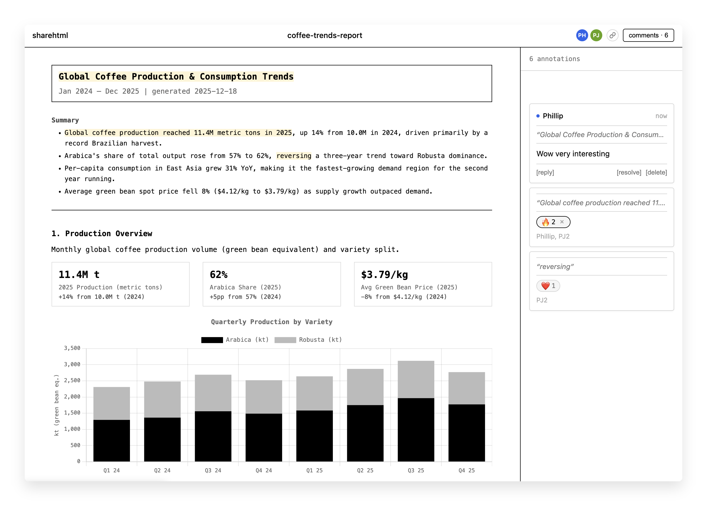

# sharehtml

I've been using coding agents like Claude Code and OpenCode to put together data reports, interactive visualizations, and educational docs, all as plain HTML files. Way more flexible than traditional BI tools. But sending HTML files around gets messy fast: you can't update them after sharing, and there's no way to get feedback inline. This is the reason I built sharehtml.



## What is sharehtml?

Deploy an HTML or Markdown file, get a link where others can view it and collaborate with comments, reactions, and live presence. Re-deploy to update the content at the same URL. Markdown files are converted to styled HTML automatically.

- **CLI deploys** — `sharehtml deploy report.html` → `https://sharehtml.yourteam.workers.dev/d/9brkzbe67ntm`
- **Collaborative** — comments, threaded replies, emoji reactions, text anchoring
- **Live presence** — see who's viewing and their selections
- **Home page** — your documents and recently viewed docs shared with you
- **Self-hosted** — runs on your own Cloudflare account

## Prerequisites

- [Node.js](https://nodejs.org/) 18+ and [pnpm](https://pnpm.io/)
- [Bun](https://bun.sh/) (for the CLI and setup script)
- [Cloudflare account](https://dash.cloudflare.com/sign-up) (free plan works)

## Quick Start

```bash
git clone https://github.com/jonesphillip/sharehtml.git
cd sharehtml
pnpm install
pnpm run setup
```

The interactive setup script walks you through everything: deploying the worker, installing the CLI, and generating an API token. Cloudflare Access is optional — the setup script asks if you want authentication. Without it, anyone with a link can view and comment.

If you enable Cloudflare Access, you'll need a [Cloudflare API token](https://dash.cloudflare.com/profile/api-tokens) with these permissions:
- **Account > Access: Apps and Policies > Edit**
- **Account > Access: Organization, Identity Providers, and Groups > Read**

When it's done, try deploying the included example:

```bash
sharehtml deploy example/coffee-report.html
# or try the markdown example:
sharehtml deploy example/sample.md
```

If a document with the same filename exists, the CLI will prompt to update it. Use `-u` to skip the prompt.

### Manual deploy

If you've already run setup and just need to redeploy:

```bash
# Deploy the worker to Cloudflare
pnpm run deploy

# Build and link the CLI globally
cd apps/cli && pnpm build && bun link
```

### Local development

```bash
pnpm dev
```

Starts the Vite dev server with Wrangler at http://localhost:5173. In dev mode, `AUTH_MODE` is `"none"` — no login required.

To use the CLI locally:

```bash
sharehtml config set-url http://localhost:5173
sharehtml config set-key dev
sharehtml deploy my-report.html
```

## Architecture

```
CLI ──► Worker ──► R2 (HTML storage)
         │
Browser ◄┘──► Durable Objects
               ├── RegistryDO (users, documents, tokens, views)
               └── DocumentDO (per-doc comments, reactions, presence via WebSocket)
```

| Component | Purpose |
|-----------|---------|
| **[Worker](https://developers.cloudflare.com/workers/)** | HTTP routing, auth, serves viewer shell and home page |
| **RegistryDO** | Global [Durable Object](https://developers.cloudflare.com/durable-objects/) — users, document metadata, API tokens, view history (SQLite) |
| **DocumentDO** | Per-document Durable Object — comments, reactions, real-time presence over WebSocket |
| **[R2](https://developers.cloudflare.com/r2/)** | Stores the actual HTML files |
| **CLI** | Bun-based command-line tool for deploying and managing documents |

## CLI Commands

| Command | Description |
|---------|-------------|
| `sharehtml deploy <file>` | Deploy an HTML or Markdown file (creates or updates) |
| `sharehtml list` | List your documents |
| `sharehtml open <id>` | Open a document in the browser |
| `sharehtml delete <id>` | Delete a document |
| `sharehtml config init` | Interactive setup (URL + API key) |
| `sharehtml config set-url <url>` | Set the worker URL |
| `sharehtml config set-key <key>` | Set your API token |
| `sharehtml config show` | Show current configuration |

## API Tokens

API tokens authenticate CLI requests. Each user has one token. The setup script generates one automatically, but you can manage tokens at `/tokens` on your sharehtml instance (generate, regenerate, or revoke).

## Configuration

### Secrets (set via `pnpm run setup` or `npx wrangler secret put`)

| Secret | Required | Description |
|--------|----------|-------------|
| `AUTH_MODE` | No | `"none"` disables auth, `"access"` enables Cloudflare Access JWT verification. Defaults to no auth if unset. The setup script sets this for you. |
| `ACCESS_AUD` | When `AUTH_MODE=access` | Cloudflare Access Application Audience tag |
| `ACCESS_TEAM` | When `AUTH_MODE=access` | Cloudflare Access team name |

## Project Structure

```
apps/
├── worker/
│   ├── src/
│   │   ├── index.ts                  # Hono app, routing
│   │   ├── routes/
│   │   │   ├── api.ts                # REST API (CRUD documents)
│   │   │   ├── viewer.ts             # Document viewer + WebSocket proxy
│   │   │   └── tokens.ts             # Token management pages
│   │   ├── durable-objects/
│   │   │   ├── registry.ts           # RegistryDO — users, docs, tokens, views
│   │   │   └── document.ts           # DocumentDO — comments, reactions, presence
│   │   ├── frontend/
│   │   │   ├── home.tsx              # Home page (document list)
│   │   │   ├── shell.tsx             # Document viewer shell
│   │   │   └── tokens.tsx            # Token management page
│   │   ├── client/
│   │   │   ├── shell-client.ts       # Viewer shell JS (presence, sidebar)
│   │   │   ├── collab-client.ts      # In-iframe collaboration (comments, reactions)
│   │   │   └── styles.css            # Shared styles
│   │   └── utils/
│   │       ├── auth.ts               # CF Access JWT + API token verification
│   │       ├── registry.ts           # getRegistry() helper
│   │       ├── crypto.ts             # sha256 utility
│   │       ├── assets.ts             # Vite asset URL resolution
│   │       └── ids.ts                # nanoid generator
│   ├── scripts/
│   │   └── setup.ts                  # Interactive production setup script
│   └── wrangler.jsonc                # Cloudflare Workers config
├── cli/
│   └── src/
│       ├── index.ts                  # CLI entry point (commander)
│       ├── commands/                 # deploy, list, open, delete, config
│       ├── api/                      # HTTP client for worker API
│       └── config/                   # Local config store (~/.config/sharehtml)
└── packages/
    └── shared/                       # Shared types (messages, comments, reactions)
```

## License

Apache-2.0
